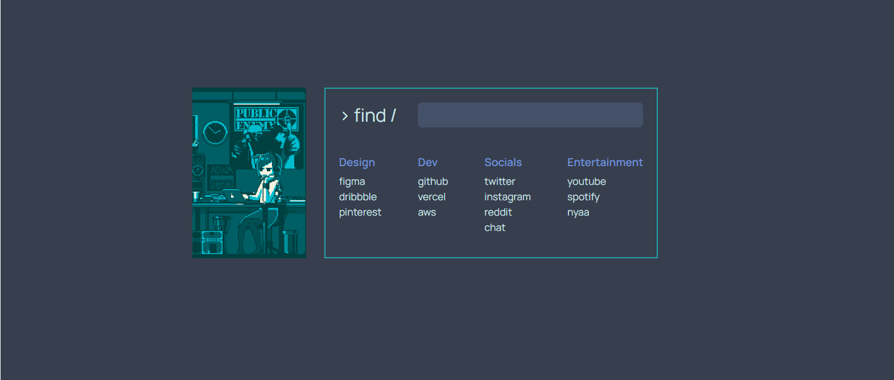

<div align="center">
   

   # Jitaku &middot; [](https://www.npmjs.com/package/npm) [](http://makeapullrequest.com) [](https://github.com/your/your-project/blob/master/LICENSE)
  
   > 🏠 a very minimal, powerful and fully customizable startpage made using react, typescript.
</div>



### [Live Preview](https://jitakupage.vercel.app/)

## Setting up Dev
```shell
git clone https://github.com/chamanbravo/jitaku.git
cd jitaku/
yarn install
yarn start
```
